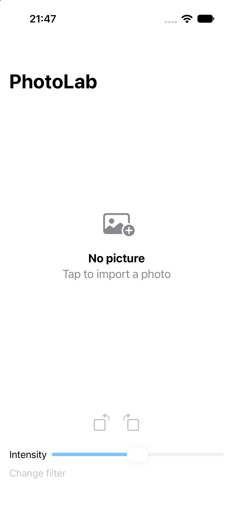
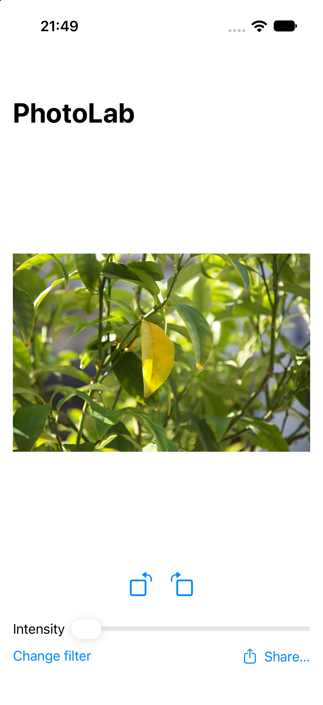
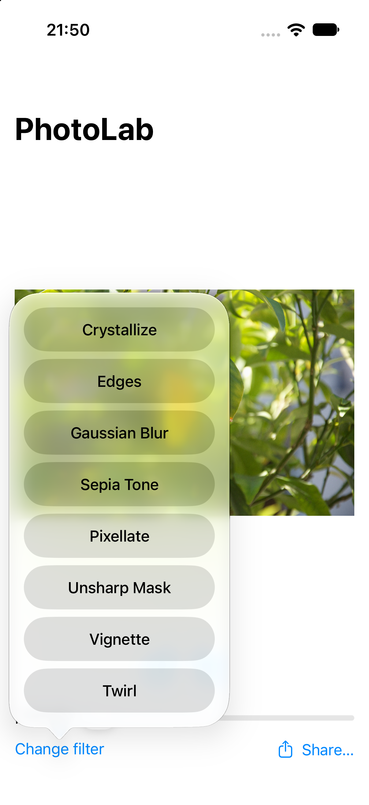
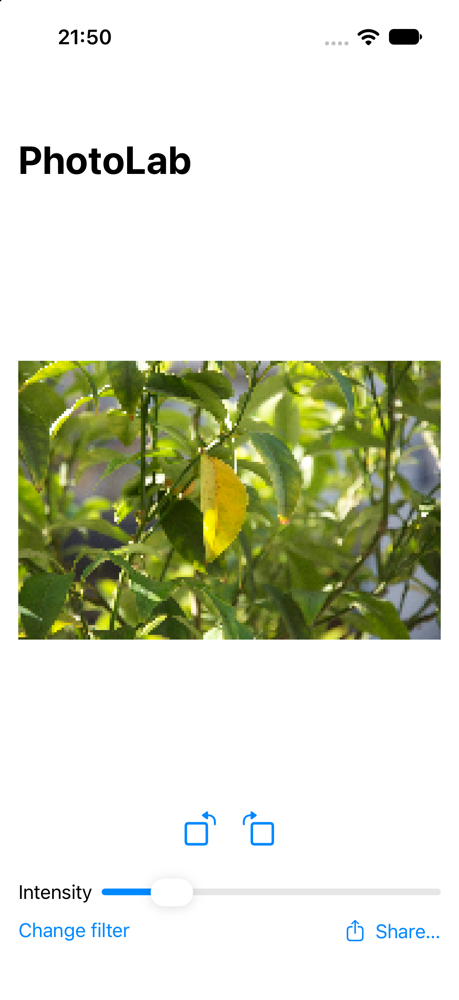
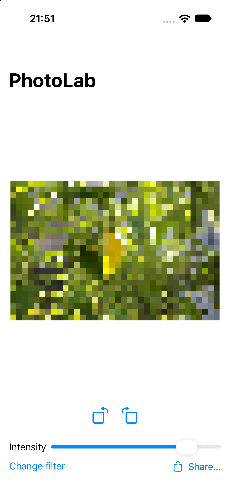
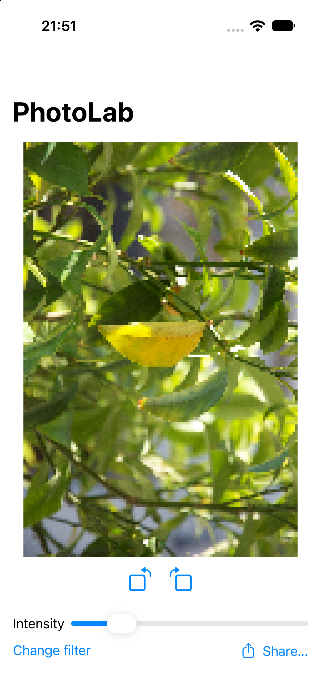

# PhotoLab

A SwiftUI photo editing app: import a picture, apply Core Image filters, tweak intensity live, rotate, and share the result.

> **Note:** This project is based on **Project 13 (Instafilter)** from [100 Days of SwiftUI](https://www.hackingwithswift.com/100/swiftui) by Paul Hudson. The original app and its core idea come from the course. See [Personal changes beyond the course](#personal-changes-beyond-the-course) for what I changed or added myself.

## Screenshots

| Empty state | Filter applied | Filter picker |
|:---:|:---:|:---:|
|  |  |  |

| Intensity: low | Intensity: high | Rotated |
|:---:|:---:|:---:|
|  |  |  |

## Features

- Import a photo from the library with `PhotosPicker`
- 8 built-in filters: Crystallize, Edges, Gaussian Blur, Sepia Tone, Pixellate, Unsharp Mask, Vignette, Twirl
- Live intensity slider, the preview updates as you drag
- Rotate the image in 90° steps, both directions
- Share the result with `ShareLink`
- App Store rating prompt after every 20th filter selection

## Tech stack

- Swift, SwiftUI
- Core Image (`CIFilter`, `CIContext`)
- PhotosUI (`PhotosPicker`), StoreKit (`requestReview`)
- Swift Concurrency (`actor`, `Task`, cancellation)
- Observation framework (`@Observable`)

## Architecture

MVVM with a separate processing layer:

```
PhotoLab/
├── App/        PhotoLab.swift             App entry point
├── UI/         ContentView.swift          View: layout and user input only
├── ViewModels/ ContentViewModel.swift     State, rotation, filter selection, task management
├── Services/   ImageProcessor.swift       actor: image loading and Core Image rendering
└── Model/      FilterOption.swift         Enum of available filters
```

- **`ContentView`** only renders state and forwards user actions.
- **`ContentViewModel`** (`@Observable`) owns the state (selected photo, filter, intensity, rotation). Any change triggers a re-render.
- **`ImageProcessor`** is an `actor` that owns the `CIContext` and does all image work, so heavy rendering stays off the main thread.

## Personal changes beyond the course

- **Moved Core Image work off the main thread** into a dedicated `ImageProcessor` actor with its own `CIContext`. In the course version the filtering runs on the main actor.
- **Cancelling stale work:** each slider or filter change cancels the previous processing task, so rapid changes don't pile up outdated renders.
- **Refactored the single-view course code into MVVM** with an `@Observable` view model.
- **Added image rotation** in 90° steps.
- **Added an 8th filter** (Twirl).
- **Scaled filter parameters to the image size:** radius, scale and center are calculated from the image dimensions instead of fixed values, so filters look consistent on photos of any resolution.
- **Replaced inline filter buttons with a `FilterOption` enum** (`CaseIterable`, `Identifiable`), so the filter list is defined in one place.

## Requirements

- iOS 17.0+
- Xcode 26 or later

## Running the project

1. Clone the repository
2. Open `PhotoLab.xcodeproj` in Xcode
3. Select an iPhone simulator or device and press Run

## Credits

Original app concept and tutorial: [Paul Hudson, Hacking with Swift](https://www.hackingwithswift.com).
